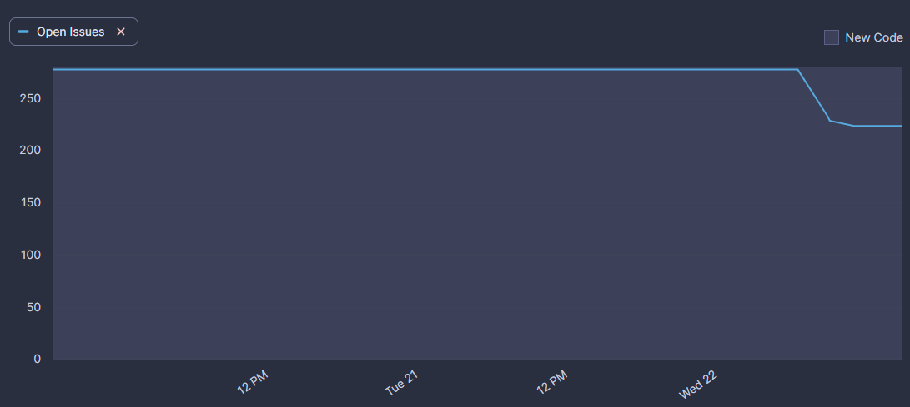
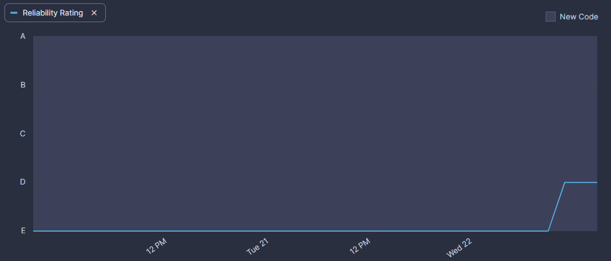
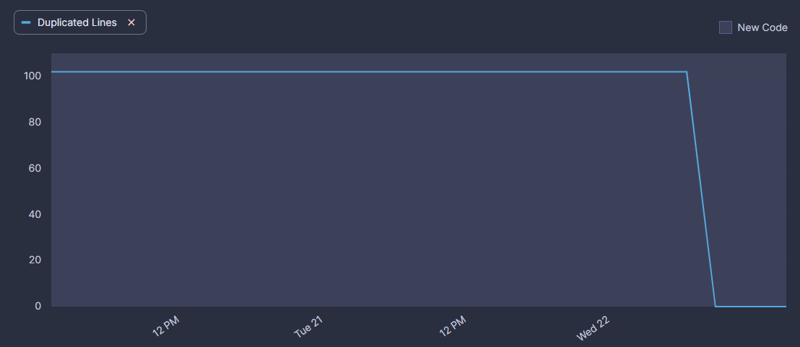

# Statikus ellenőrzés - BKTQBH

A statikus ellenőrzés elvégzéséhez a CI pipeline ki lett egészítve egy SonarCloud analízissel is. Az első futtatás eredményeképp rengeteg különböző hibát felismert a rendszer, melyek közül a határidő szűkössége miatt a legsúlyosabbak lettek kijavítva.

### Eredmények
Mint a képen is látható, a hibák száma csökkent, a portál által jelzett kódminőség pedig javult:

Eközben a kódduplikációt is sikerült megszüntetnünk:

### Tanulságok

Ebből a példából kiderült, hogy a különböző statikus kódellenőrző szoftverek kifejezetten hasznosak egy termék fejlesztése közben. Rengeteg olyan hibát volt képes jelezni a SonarCloud, melyek elsőre nem tűntek problémásnak, viszont kisebb utánanézést követően egyértelművé vált, hogy mennyire meg tudják nehezíteni később a program fejlesztését.
Különösen hasznos funkció a SonarCloud oldalán a hibák mellett feltűntetett leírás, mely magyarázatot ad a hiba okára, lehetséges következményeire.
A code complexity jelzésnek köszönhetően a kód sokkal olvashatóbbá tehető, a késöbbi fejlesztés sokkal egyszerűbbé válik.