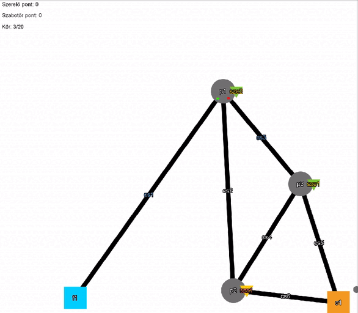

# **Manuális tesztek**

### **A manuális tesztek mindegyikének a következő a felépítése:**
X. teszteset: név  
Leírás: Rövid leírása tesztnek  
Bemenetek: A teszthez szükséges bemenetek, inicializáló lépések  
Elvárt kimenet: A teszt elvárt eredménye.  
Teszt eredménye: A teszt elvárt eredménye, egyezés vagy eltérés az elvárttól. (Opcionálsan egyéb, nem szorosan kötődő észrevételek)  
(Kép: ): Opcionális kép a tesztelésről. 

### *1. teszteset: Fájlbetöltés funkció*
***Leírás:*** A pálya betöltése előre elkészített fájl alapján. Helyes és hibás pályanév és pályaleíró szintaktika.
  
***Bemenetek:*** Egy helyes és helytelen pályabetöltő szintaktikát tartalmazó txt fájl. Továbbá helyes és hibás fájlnév.  
  
***Elvárt kimenet:*** A felület betölti a helyes pályát, ha jól adjuk meg a fájl nevét. Rossz fájlnév vagy inicializáló parancsok esetén pedig jelzi a felhasználónak, hogy hibás.  
  
***Teszt eredménye:*** Helyes szintaktikával megadott pálya betöltése sikeres, a felület elemei kivétel nélkül megjelennek. Hibás vagy üres fájl név esetén hibaüzenetet kapunk, míg rossz forrásfájlnál nem generálódik le pálya. A teszt sikeres.  

___

### *2. teszteset: Új játék gomb működése*
***Leírás:*** Az új játék gomb többszöri lenyomásának hatása és az általa generált véletlenszerű pályaelosztás tesztelése.
  
***Bemenetek:*** Új játék gomb
  
***Elvárt kimenet:*** A gomb lenyomásakor az új pálya hibátlanul betöltődik és a felületen egy jól látható grafikus reprezentáció jelenik meg.
  
***Teszt eredménye:*** Minden gombnyomás után a korábbi pálya nyomtalanul törlődik, így nem kavarodik össze az új pályával. Tapasztalható némely esetben az, hogy két cső részben egymásra csúszik a felületen. Ettől függetlenül a pályagenerálás kifogástalan. Többszöri gombnyomás esetén sincsenek problémák az új pályákkal. A teszt sikeres.  

___

### *3. teszteset: Debug parancsok*
***Leírás:*** A debug parancsok elérhetőségének és letiltásának tesztje.
  
***Bemenetek:*** A konzol felületen a különböző debug parancsok beírása.
  
***Elvárt kimenet:*** Debug parancsok elérhetők a pálya kézzel való elkészítésének folyamata során, míg éles játékkörnyezetben ezek használata nem engedélyezett.
  
***Teszt eredménye:*** Minden debug parancs beírásakor a megfelelő hibaüzenet jelzi, hogy azok le vanak tiltva, és nem futtatja le a parancsot. A teszt sikeres. 

___

### *4. teszteset: Hibás parancsoknál felajánlott javítások*
***Leírás:*** Hibásan beírt parancsnál a parancsértelmező általt felajánlott javítás működésének tesztje.
  
***Bemenetek:*** Egy hibás parancs név, egy hibás parancs paraméter és a javítás elfogadásához szükséges parancs.
  
***Elvárt kimenet:*** Valós segítséget nyújt a felhasználónak vagy hibátlanul lefut a javítás által felkínált parancs.  

  
***Teszt eredménye:*** Rosszul beírt parancs esetén megmutatja a parancsértelmező annak helyes használatát. Rossz paraméter esetén a legközelebbi egyezés alapján lehet paraméter javítást kapni. Ekkor a javítás elfogadása után a parancs helyesen lefut az új paraméterekkel. Amennyiben nem adunk választ a javítás kérdésére, az továbbra is fennál több parancs beírása után, így a kör további szakaszában vagy egy teljesen más körben a javítás újrafelhasználható, amivel többször tud egy adott játékos lépni. Ugyanakkor ezek az utólag kért javítások ha hibásak vagy nem elérhető cselekvésre mutatnak, akkor nem futnak le. A teszt részben sikeres.

  

___

### *5. teszteset: Lépés cselekvés ellenőrzése*
***Leírás:*** A lépés cselekvéssel kapcsolatos minden következmény és korlátozás tesztje.
  
***Bemenetek:*** A "lep" parancs szerelő és szabotőr paraméterekkel, minden lehetséges pályaelemre.
  
***Elvárt kimenet:*** Ha a játékos üres csőre vagy bármilyen más elérhető játékelemre lép rá, akkor az sikeresen lefut és ezt a grafikus felület is megfelelően jelzi.
  
***Teszt eredménye:***  
- Üres csőre való lépés mindkettő játékostípusnál sikeres volt, és a grafikus felület is jól értelmezhető módon átmozgatta a karakterek ikonjait a forráshelyről a célhelyre. Ez az alteszt sikeres.

- Ha egy olyan csőre próbálunk lépni, ahol már van másik játékos akkor nem történik meg a cselekvés. Ez érvényes mindkettő játékostípusnál. Ez az alteszt sikeres.

- Ha egy pumpára, ciszternára, vagy forrásra lép több játékos akkor el tud mindegyik ott helyezkedni, és a grafikus felület is a legjobb helykihasználtság érdekében arrébb mozgatva elhelyezi az összes játékost a játékelemen. Ez az alteszt sikeres.

- Ha nem létező játékost adunk meg, akkor a parancsértelmező egy üzenettel jelzi, hogy a paraméter hibás, és nem fut le a parancs. Ez az alteszt sikeres.  

- Egyéb észrevétel: A lépés cselekvéshez köthetően egy olyan speciális játék szituáció alakulhat ki, ahol két szerelő közrezár egy szabotőrt, így az nem tud tovább lépni amíg az egyik szerelő el nem hagyja a helyét. Ezt nem technikai hibának, inkább játék egyensúly helyzetbeli lehetséges problémának tartom.  

___

### *6. teszteset: Szerelés cselekvés ellnőrzése*
***Leírás:*** A szerelés cselekvéssel kapcsolatos minden következmény és korlátozás tesztje.
  
***Bemenetek:*** A "szerel" parancs különböző játékos paraméterekkel, egy hibás cső és pumpa, és egy jól működő cső.
  
***Elvárt kimenet:*** A paraméterként megadott szerelő, aki csövön vagy pumpán áll, megjavítja azt. Rajtuk pedig tovább folyik a víz.  

***Teszt eredménye:***
- Lyukas cső esetén a szerelő megjavítja a csövet, amin utána folyik tovább a víz. Ez az alteszt sikeres.

- Hibás pumpa esetén az javításra kerül, majd tovább pumpálja a vizet. Ez az alteszt sikeres.

- Ha szabtotőrt adunk meg a parancs paraméterekenént, akkor a szerelés interakció nem megy végbe. Ez az alteszt sikeres.

- Bármilyen szerelés interakció után a grafikus felület helyesen jelzi, hogy a játékelem javításra került. Ez az alteszt sikeres.

- Ha nem létező szerelőt adunk meg, akkor a parancsértelmező egy üzenettel jelzi, hogy a paraméter hibás, és nem fut le a parancs. Ez az alteszt sikeres. 

- Ha egy jól működő játékelemet szeretnénk javítani akkor az interakció nem megy végbe. Ez az alteszt sikeres.  

___

### *7. teszteset: Lyukasztás cselekvés ellnőrzése*
***Leírás:*** A lyukasztás cselekvéssel kapcsolatos minden következmény és korlátozás tesztje.
  
***Bemenetek:*** A "lyukaszt" parancs játékos paraméterrel, egy hibátlan cső és pumpa, és egy jól működő cső.
  
***Elvárt kimenet:*** A paraméterként megadott szabotőr, aki csövön áll, elrontja azt. Rajtuk pedig nem folyik tovább a víz. 

***Teszt eredménye:***
- Hibátlan cső esetén a játékos kilyukasztja a csövet, amin utána nem folyik tovább a víz. Ez az alteszt sikeres.

- Csőtől eltérő játékelem lyukasztása esetén a parancs nem fut le, nincs hatása. Ez az alteszt sikeres.

- Bármilyen lyukasztás interakció után a grafikus felület helyesen jelzi, hogy a cső javításra került. Ez az alteszt sikeres.

- Ha nem létező játékost adunk meg, akkor a parancsértelmező egy üzenettel jelzi, hogy a paraméter hibás, és nem fut le a parancs. Ez az alteszt sikeres. 

- Ha egy már kilyukasztott csövet szeretnénk kilyukasztani akkor a parancs nem fut le, nincs hatása. Ez az alteszt sikeres.  

___ 

### *8. teszteset: Pumpa állításának folyamata*
***Leírás:*** Egy pumpa átállításának tesztelése.
  
***Bemenetek:*** Az "allit" parancs mindkettő játékostípussal paraméterként és közvetlenül és közvetetten csatlakozó csövek.
  
***Elvárt kimenet:*** A paraméterként megadott játékos, aki pumpán áll, átállítja azt az egyik irányból a másikba, ahol a víz haladásának iránya is megváltozik.

***Teszt eredménye:***
- Ha a játékos nem pumpán áll az interakció nem megy végbe. Ez az alteszt sikeres.

- Ha olyan csövet adunk meg ami nem a pumpához kapcsolódik akkor a pumpa marad az eredeti állapotában. Ez az alteszt sikeres.

- Két helyes cső megadása után a pumpa sikeresen átállítódik a megadott csövek sorrendje szerint. A víz ezután helyesen továbbfolyik a kimeneti cső irányába. Ez az alteszt sikeres.

- Ha nem létező játékost adunk meg, akkor a parancsértelmező egy üzenettel jelzi, hogy a paraméter hibás, és nem fut le a parancs. Ez az alteszt sikeres. 

- Ha nem létező csövet adunk meg, akkor jelzi a felület, hogy elírtunk valamit, és felajánl egy javítást. Ez az alteszt sikeres.

- Sikeres cső állításkor a grafikus felület jelzi, hogy melyik az adott pumpánál a ki- és bemeneti cső. Ez az alteszt sikeres.   

___ 

### *9. teszteset: Játékelem felvételének tesztelése.*
***Leírás:*** A szerelő játékos felvesz egy csövet vagy pumpát a játéktér egyik eleméről.
  
***Bemenetek:*** A "felvesz" parancs mindkettő játékostípussal paraméterként, egy ciszterna, és egy pumpa amihez van csatlakoztatva cső.
  
***Elvárt kimenet:*** A paraméterként megadott szerelő a pumpát egy olyan ciszternáról veszi fel, ahol van termelve már egy. A csövet pedig akkor tudja felvenni, ha a pumpán áll és ahhoz közvetlen csatlakozik a felvenni kívánt cső.

***Teszt eredménye:***
- Ha szabotőrt adunk meg bármilyen játékelem felvételénél paraméterként, a parancs nem fut le, a játékelem nem kerül felvételre. Ez az alteszt sikeres.

- Ha a ciszternán van termelt pumpa, akkor a szerelő sikeresen felveszi és elraktározza azt a hátizsákjában. Ez az alteszt sikeres.  
  
- Ha pumpán adjuk ki a pumpa felvételének parancsát, akkor a program hibát ad, de a játék folytatódik tovább. A hiba a program futását nem akadályozza. Ez az altesz részben sikeres.

- Ha nem létező szerelő játékost adunk meg, akkor a parancsértelmező egy üzenettel jelzi, hogy a paraméter hibás, és nem fut le a parancs. Ez az alteszt sikeres.

- Ha a ciszternán nincsen termelt pumpa, akkor nem történik semmilyen interakció. Ez az alteszt sikeres. Kép magyarázata: A p2 és p3 között a felvétel előtt egy cső volt.

- Ha pumpán állva felveszünk egy csövet, akkor az az elvártaknak megfelelően eltűnik a pályáról. Ez az alteszt sikeres.
  

- Ha nem pumpán állunk vagy olyan csövet szeretnénk felvenni ami nem létezik vagy nem közvetlenül kapcsolódik a pumpához, akkor a parancs nem fut le és annak nem lesz hatása. Ez az alteszt sikeres.
- Ha sikeresen felvettünk egy csövet, akkor a víz nem folyik tovább a már nem létező csövön, a rendszer újrakalkulálja a víz útvonalát a még létező csövek és pumpák alapján. Ez az alteszt sikeres.

    

- Egyéb megjegyzés: Szerelőként képesek vagyunk a saját szerelőtársunk alól kivenni a csövet amivel az kiesik a játékból. Ezt nem technikai hibának, inkább játékmenet szintú problémának tartom.

___ 

### *10. teszteset: Építés folyamatának tesztelése.*
***Leírás:*** A szerelő játékos egy új játékelemet épít és hoz létre.
  
***Bemenetek:*** Az "epit" parancs mindkettő játékostípussal paraméterként, egy pumpa és egy cső a szerelő hátizsákjában.
  
***Elvárt kimenet:*** A paraméterként megadott játékos egy pumpát vagy csövet rak le, ami a többi játékelemmel kapcsolatba lép és a típusa szerinti működést mutat.

***Teszt eredménye:***
- Ha a szerelőnél van pumpa és csövön áll, akkor a cső ketté lesz vágva és közé berak egy új pumpát, ami utána a többi pumpának megfelelő módón működik. Ez az alteszt sikeres.  

- Ha a szerelőnél nincsen a hátizsákban pumpa, vagy nem csövön áll, akkor az építés nem hajtódik végre, a játéktér marad a korábbi állapotában. Pumpa hiánya esetén a következő üzenetet kapjuk: "Nincsen pumpa a hátizsákban." Ez az alteszt sikeres.

- Ha nem létező játékost adunk meg, akkor a parancsértelmező egy üzenettel jelzi, hogy a paraméter hibás, és nem fut le a parancs. Ez az alteszt sikeres. 

- Ha a szerelőnél van cső, akkor lehelyezi azt, és összeköti két másik játékelemmel. Ekkor a cső aktiválódik és átfolyhat rajta a víz. Ez az alteszt sikeres.
  

- Ha a szerelőnél nincsen cső, akkor a parancs nem kerül kiértékelésre, így nincs hatása sem. Ez az alteszt sikeres.
___ 

### *11. teszteset: Cső ragadóssá tételének tesztje.*
***Leírás:*** A játékos ragadóssá tesz egy csövet.
  
***Bemenetek:*** A "ragad" parancs, egy játékossal paraméterként.
  
***Elvárt kimenet:*** A paraméterként megadott játékos, aki csövön áll, ragadóssá teszi a csövet. A cső egy előre beállított kör számig lesz ragadós.

***Teszt eredménye:***
- Egy csövön állva mindkettő játékos típus sikeresen ragadóssá teszi a csövet, amit a grafikus felület jól látható módon jelez is a felhasználónak.
  

- Ha nem létező játékost adunk meg, akkor a parancsértelmező egy üzenettel jelzi, hogy a paraméter hibás, és nem fut le a parancs. Ez az alteszt sikeres. 

- Ha nem csövön állunk az interakció nem megy végbe, a cső marad az eredeti állapotában. Ez az alteszt sikeres.
- A beállított körszám letelte után a cső sikeresen újra normál állapotba kerül.
___ 

### *12. teszteset: Ragadós cső hatása a játékosokra*
***Leírás:*** Játékos ragadós csőre való lépésének következményei és hatásai.
  
***Bemenetek:*** Egy ragadós cső és egy bármilyen játékos.
  
***Elvárt kimenet:*** A játákos rálép a ragadós csőre majd a korábban megadott kör szám leteltéig nem tud onnan más mezőre lépni.

***Teszt eredménye:***
Ragadós csövön álló játékos nem tud lépés cselekvést kezdeményezni amíg a cső vissza nem áll a normál állapotába. Miután eltelt a megadott körszám, a lépés parancs sikeresen lefutott és a játékos a szomszédos mezőre lépett. Ez az alteszt sikeres.  

___ 

### *13. teszteset: Cső csúszóssá tételének tesztje.*
***Leírás:*** A szabotőr csúszóssá tesz egy csövet.
  
***Bemenetek:*** A "csuszik" parancs, mindkét játékostípussal paraméterként.
  
***Elvárt kimenet:*** A paraméterként megadott szabotőr, aki csövön áll, csúszóssá teszi a csövet. A cső egy előre beállított kör számig lesz csúszós.

***Teszt eredménye:***
- Egy csövön állva a szabotőr sikeresen csúszóssá teszi a csövet, amit a grafikus felület jól látható módon jelez is a felhasználónak.

- Ha nem csövön állunk az interakció nem megy végbe, a cső marad az eredeti állapotában. Ez az alteszt sikeres.

- Ha nem létező szabotőrt adunk meg, akkor a parancsértelmező egy üzenettel jelzi, hogy a paraméter hibás, és nem fut le a parancs. Ez az alteszt sikeres. 

- Ha szerelő próbál csúszóssá tenni egy csövet, akkor az nem megy végbe, nem lesz a cső csúszós. Ez az alteszt sikeres.

- A beállított körszám letelte után a cső sikeresen újra normál állapotba kerül.
___ 

### *14. teszteset: Csúszós cső hatása a játékosokra*
***Leírás:*** Játékos csúszós csőre való lépésének következményei és hatásai.
  
***Bemenetek:*** Egy csúszós cső és kétféle játékos típus.
  
***Elvárt kimenet:*** A játákos rálép a csúszós csőre majd a korábban megadott kör szám leteltéig nem tud onnan más mezőre lépni.

***Teszt eredménye:***
- A játékos, aki rálép a csúszós csőre, automatikusan túlcsúszik a cső ellentétes oldalán lévő mezőre. Ez az alteszt sikeres.
- Mind a szerelőkre, mind a szabotőrökre hatással van, ha egy cső csúszik. Ez az alteszt sikeres.
- Mezőtől függetlenül sikeresen át tud csúszni a játékos,  forrás és ciszterna esetén is.
 

___ 

### *15. teszteset: Kör vége esemény tesztelése*
***Leírás:*** Egy kör végi események lefutásának tesztje.
  
***Bemenetek:*** A "frissit" parancs és egy tesztpálya.
  
***Elvárt kimenet:*** A parancs lefutása után a víz tovább folyik az elérhető csöveken, a pumpákon pedig a beállított irány szerint folyik tovább. A csúszós és ragadós csövek visszaállnak normál állapotba. A parancs akkor is hívható, ha egy adott játékos nem csinált semmit.

***Teszt eredménye:***  
A teszt könnyebb szemléltetése érdekében a következő altesztek egymásra építenek sorrendjük szerint.

- Első körben a forrásból átfolyik a hozzá kötött csőbe, ami így megtelik vízzel, amit a grafikus felület jól látható módon jelez is a felhasználónak. A víz nem folyik tovább a pumpa beállítása hiányában. Ez az alteszt sikeres.  

- A pumpát ezután átállítva a következő körben újabb kör vége esemény hívás után a víz tovább folyik a pumpa kimenete felé. A korábbi csövön sikeresen folyik át a víz továbbra is. Ez az alteszt sikeres.

___ 

### *16. teszteset: Szerelő pontszerzése*
***Leírás:*** Szerelő játékosok pontszerzéseinek folyamata.
  
***Bemenetek:*** Egy tesztpálya és egy előkészített játékszituáció.
  
***Elvárt kimenet:*** A tesztpályán elő van készítve egy olyan szituáció, ahol a kör vége után a ciszternába folyik a víz. A szerelőknek ezért pontot kell kapniuk.

***Teszt eredménye:***  
- A pontszám csak akkor kerül megadásra, ha a teljes útvonal be van állítva, és megfelelő irányba vannak helyezve a pumpák. Ez az alteszt sikeres.
  

- Csak a szerelő kap pontot, és csak egy pontot, a jóváírás nem történik meg többször. Ez az alteszt sikeres.

___ 

### *17. teszteset: Szerelő pontszerzése*
***Leírás:*** Szabotőr játékosok pontszerzéseinek folyamata.
  
***Bemenetek:*** Egy tesztpálya és egy előkészített játékszituáció.
  
***Elvárt kimenet:*** A tesztpályán elő van készítve egy olyan szituáció, ahol a víz egy megadott útvonalon már folyik. A szabotőr a cső kilyukasztása után minden körben az elfolyt vízmennyiség után pontot kap.

***Teszt eredménye:***  
- A kilyukasztott cső után a szabotőr pontot kap, ha volt benne víz, vagy belefolyik későbbi körben. Ez az alteszt sikeres.

- Ha a szabotőr olyan csövet lyukaszt ki, amiben nem volt víz, akkor nem kap pontot. Ez az alteszt sikeres.

- A szabotőr minden körben megkapja a pontot az adott kilyukasztott csőre, ha sikeresen kifolyik belőle a víz a lyukon. Ez az alteszt sikeres.

___ 

### *18. teszteset: Játék vége esemény tesztje*
***Leírás:*** Játék megnyerése szerelő és szabotőr által.
  
***Bemenetek:*** Egy előkészített tesztpálya, ahol vagy a szerelők, vagy a szabotőrök vezetnek pontszámban.
  
***Elvárt kimenet:*** A megadott maximum körszám lejárta után az a játékostípus nyer, akinek több pontja van.

***Teszt eredménye:***  
- Ha a szerelőknek van több pontja és véget ér az utolsó kör, akkor a grafikus felület ezt jelzi és véget ér a játék. Ez az alteszt sikeres.

- Ha a szabotőröknek van több pontja, akkor ezt ismét jelzi egy másik üzenettel, és véget ér a játék. Ez az alteszt sikeres.  

- Ha egyenlő a két játékostípus pontja a játék végén, akkor a szerelők győznek és véget ér a játék.
 
 ___ 

### *19. teszteset: Pumpa és cső termelés tesztje*
***Leírás:*** Ciszterna pumpa termelésének folyamata.
  
***Bemenetek:*** Egy ciszterna, ami pumpákat és csöveket termel.
  
***Elvárt kimenet:*** Minden körben a ciszterna termel pumpát vagy csövet, amit a szerelők fel tudnak venni.

***Teszt eredménye:***
- Ha a ciszerna termelt csövet vagy pumpát, akkor az oda lépő játékos sikeresen fel tudja azt venni, és elrakni a hátizsákjába, ekkor az ott lévő termelt mennyiség lecsökken.
- A ciszterna minden körben sikeresen termel valamelyiket a két pályaelem közül.

___ 

### *20. teszteset: User experience tesztek
***Leírás:*** Felhasználói élmény vizsgálata.
  
***Bemenetek:*** Minden korábbi teszteset kimenete.
  
***Elvárt kimenet:*** A felület felhasználóbarát, nincsenek zavaró elemek, a játékmenet hibamentes.

***Teszt eredménye:***  
A felhasználó felület letisztult, az egyes grafikus elemek jól értelmezhetők. Az egyes animációk a felületen nem zavaróak. A parancsértelmező kényelmesen használható, olykor viszont kevés információt közöl a felhasználóval. A grafikus elemek nem takarják ki egymást. A gombok és szövegek mérete megfelelő. Összességében a teszt sikeres.